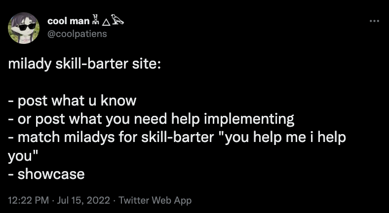
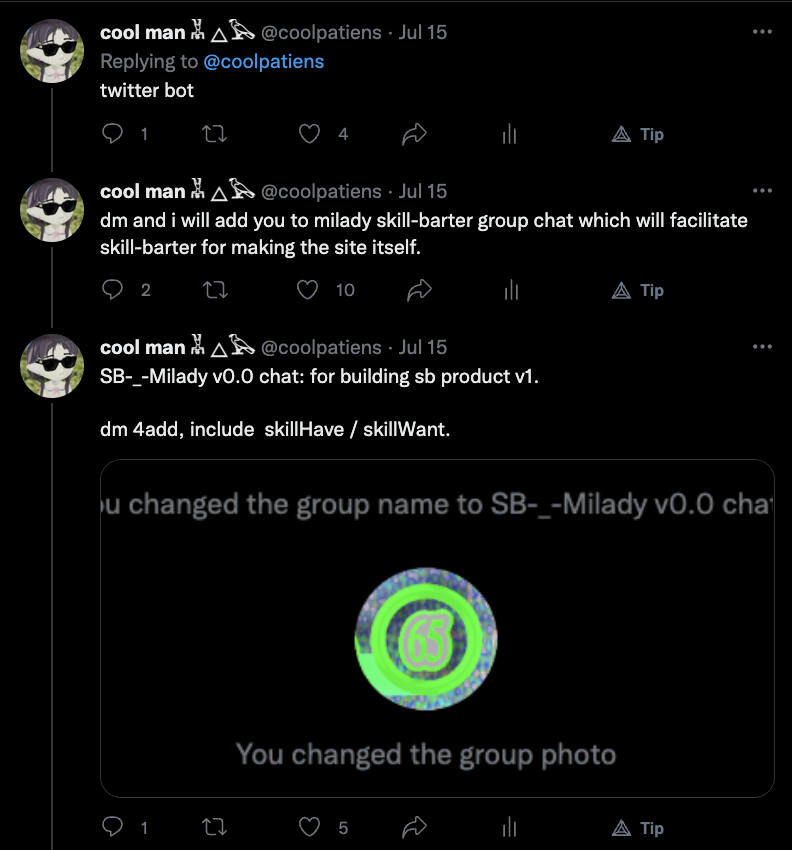
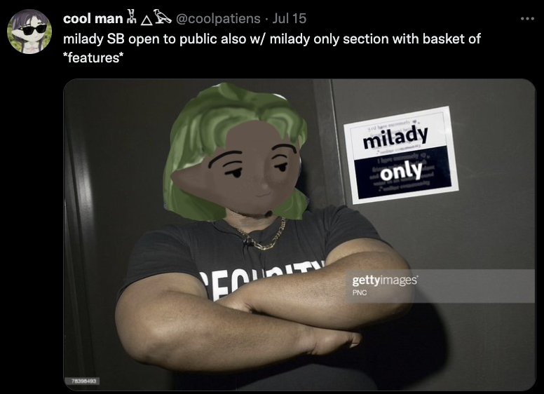
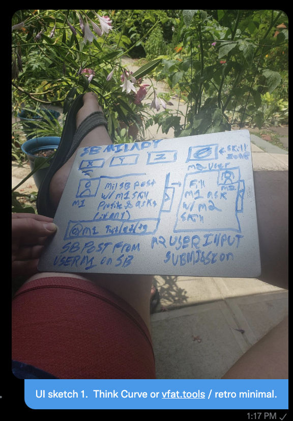

# SBM

```
         ▄▄
        ▄██
         ██
 ▄██▀███ ██▄████▄ ▀████████▄█████▄
 ██   ▀▀ ██    ▀██  ██    ██    ██
 ▀█████▄ ██     ██  ██    ██    ██
 █▄   ██ ██▄   ▄██  ██    ██    ██
 ██████▀ █▀█████▀ ▄████  ████  ████▄


 SB-_-Milady [==------------------]  10%
```

## Origin Tweet







## UI sketch 1 & day 1 product vision




UI sketch 1

Skill Zone Navigation + Skill Card List View w/ Barter Drawer

Style: Retro-Minimal, lightweight, think Curve or vfat.tools or doodad.dev

### Skill Card: renders a vertical list of SB milady user’s Skill Cards

- PFP top left of card, optionally could show a ‘hexagon’ milady via wallet sig.
- Skill content in card.
- Socials on bottom of card

### Barter Drawer: pull tab on right side of card, expands a barter drawer

Here the browsing user inputs their barter details.

### Barter obj: goes in the Barter Drawer

Barter is the overlap or join between skills + skill asks

M1.skills = [ableton, photoshop, vast deep cut music catalog, speaks protugeese

M1.skillAsks = [ financial modeling of asset in an existing Grafna dashboard ]

M2.skills = [ quantitative finance, python, woodworking crafts, competition level Pool and open to hustling games in bars]

M2.skillAsks = [wants to flirt with Portuguese women during upcoming trip to Lisbon ]

## Flow Example

Example Simplest Barter is between 2 users M1, M2. _potential for AMM style CoW barter ring trades is interesting as fuck but certainly also hard as fuck. hold for v2_

M2 is browsing SB_Milady

M1 Skill Card is on page and M2 user wants to make Barter.

M2 expands Barter Drawer on M1 Skill Card, is filling out details. M2 skillAsk is portugeese lessons, as seen above. M1 wants some simple financial models in Grafna (perhaps they would accept Dune.xyz dashboards? maybe M2 can do that easier than grafna. Perhaps M1 doesnt know about dune.xyz. That is bartering. )

M2 submits, when M1 loads SB Milady can view a dashboard of some kind that contains their incoming barters, and respond in a similar {Item}->{Drawer response} format.

M1 can accept / decline the Barter, or start a dialog.

## Escrow Potential, Oracle Problems, and "putting _trust_ on the internet, maaaannn"

Potential for some kind of escrow mechanism, but big oracle problem considerations there given the flexible and obscure potential breadth of skills being offered by milady. I have a _perhaps naive_ belief that there could exist an on-chain community with high degrees of trust between its members. There may only ever be partial solutions to the "_oracle problem_", and all creative or commercial endeavors are, end of day, really based on trust. If that is true, and if it's easier to trust the 100 people who live in your neighborhood than it is to trust the 1000x100 people that live in your municipality, perhaps there’s hope for a "_cryptographic digitial organization_" with finite, tokenized membership. Lol, tried not to use the D@O word. Anyway... personally, I think Milady may represent just such a community where a kind of trust that pwns the oracle could exist. If not, who cares, didn't ask, plus no swag, cope 4ever, :sunglasses: :v:
